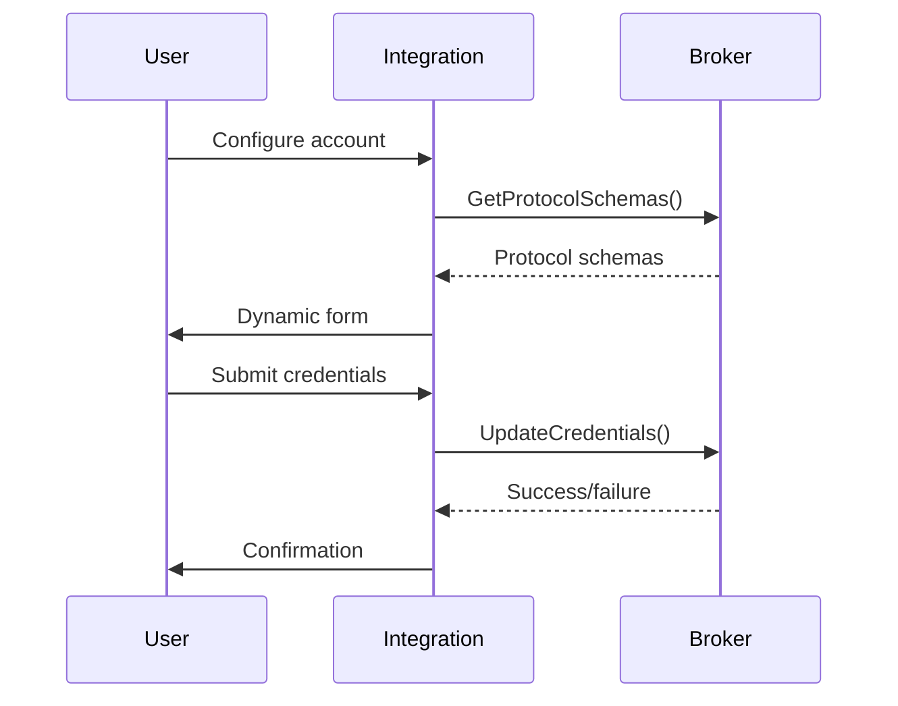

# Data-Driven Configuration System

## Overview

The Call Assist integration now features a fully data-driven configuration system that dynamically generates user interface forms based on schema definitions provided by the broker at runtime. This eliminates the need to modify integration code when adding new protocols or updating existing ones.

## Architecture

### 1. Protocol Schema Definition

The broker exposes protocol configuration schemas via the `GetProtocolSchemas` gRPC method. Each schema includes:

- **Protocol metadata**: Name, display name, description
- **Credential fields**: Required authentication fields with types, validation, and help text
- **Setting fields**: Optional configuration fields
- **Examples**: Sample account IDs to guide users

### 2. Field Type System

The system supports multiple field types with appropriate UI controls:

- `FIELD_TYPE_STRING` - Text input
- `FIELD_TYPE_PASSWORD` - Masked password input
- `FIELD_TYPE_INTEGER` - Number input
- `FIELD_TYPE_BOOLEAN` - Checkbox
- `FIELD_TYPE_SELECT` - Dropdown with predefined options
- `FIELD_TYPE_URL` - URL input with validation
- `FIELD_TYPE_EMAIL` - Email input with validation

### 3. Dynamic Form Generation

The integration dynamically generates Home Assistant config flow forms using:

- **Voluptuous schemas** built from field definitions
- **Localized strings** with dynamic placeholders
- **Validation rules** based on field requirements
- **Help text** from field descriptions

## Example Protocol Schema

```json
{
  "matrix": {
    "display_name": "Matrix",
    "description": "Matrix is an open standard for interoperable, decentralised, real-time communication.",
    "credential_fields": [
      {
        "key": "homeserver",
        "display_name": "Homeserver URL",
        "description": "The Matrix homeserver URL (e.g., https://matrix.org)",
        "type": "FIELD_TYPE_URL",
        "required": true,
        "default_value": "https://matrix.org",
        "sensitive": false
      },
      {
        "key": "access_token",
        "display_name": "Access Token",
        "description": "Your Matrix access token. Get this from Element > Settings > Help & About > Advanced.",
        "type": "FIELD_TYPE_PASSWORD",
        "required": true,
        "sensitive": true
      }
    ],
    "example_account_ids": ["@alice:matrix.org", "@bob:example.com"]
  }
}
```

## Benefits

### 🔧 **Maintainability**
- No integration code changes needed for new protocols
- Schema definitions centralized in broker
- Protocol updates automatically reflected in UI

### 🚀 **Extensibility**
- New protocols automatically appear in config flow
- Custom field types and validation supported
- Protocol-specific help text and examples

### 🛡️ **Type Safety**
- gRPC schema definitions ensure consistency
- Field validation happens at multiple levels
- Proper error handling and user feedback

### 📱 **User Experience**
- Consistent UI across all protocols
- Context-sensitive help text
- Smart defaults and examples

## Implementation Details

### Broker Side

1. **Schema Definition**: `GetProtocolSchemas()` method in `main.py:490+`
2. **Protocol Registry**: Schema definitions stored per protocol
3. **Field Mapping**: Protobuf field types to validation rules

### Integration Side

1. **Dynamic Config Flow**: `dynamic_config_flow.py`
2. **Schema Client**: `get_protocol_schemas()` method in `grpc_client.py`
3. **Form Builder**: `_build_voluptuous_schema()` function

### Configuration Flow



## Testing

The system includes comprehensive tests:

- **Schema Retrieval**: `test_dynamic_config.py` validates schema loading
- **Account Creation**: Tests dynamic credential validation
- **Form Generation**: Validates voluptuous schema building

## Future Enhancements

### 🔮 **Planned Features**
- **Field Dependencies**: Show/hide fields based on other field values
- **Custom Validators**: Protocol-specific validation logic
- **Account Templates**: Pre-configured account types
- **Bulk Import**: Import multiple accounts from files

### 🎯 **Plugin Integration**
- **Plugin-Defined Schemas**: Plugins can provide their own schema definitions
- **Runtime Schema Updates**: Hot-reload schema changes without restart
- **Advanced Field Types**: File uploads, multi-select, date pickers

## Migration Guide

### For Plugin Developers

1. **Define Schema**: Add schema definition to your plugin metadata
2. **Field Mapping**: Map credential requirements to field types
3. **Help Text**: Provide clear descriptions and examples
4. **Validation**: Define field validation rules

### For Users

1. **Automatic Migration**: Existing accounts continue to work
2. **Enhanced UI**: New configuration screens with better guidance
3. **Protocol Discovery**: Available protocols automatically detected

---

This data-driven approach ensures the Call Assist integration remains flexible, maintainable, and user-friendly as new protocols are added and existing ones evolve.